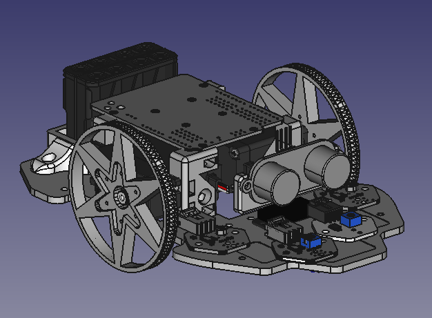

# evoPrintBot  v0.6

Se trata de una simplificación del robot [Evolution de Bq](https://github.com/bq/printbots/tree/master/Evolution)

Se han eliminado algunas piezas y simplificado otras para acortar el tiempo de impresión y el de montaje

Se han utilizado algunos componentes de la [Printbot Part Library](https://github.com/Obijuan/printbot_part_library)

Puedes compartir y utilizar cualquier parte de este diseño :)

